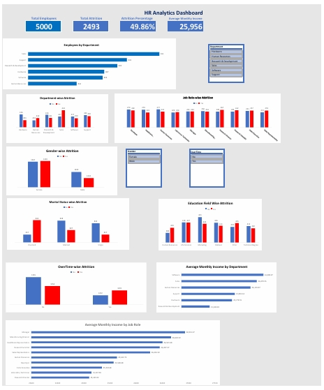

# 📊 HR Analytics Dashboard (Microsoft Excel)

## 📌 Project Overview

This project is an interactive **HR Analytics Dashboard** built using **Microsoft Excel**. The dashboard helps analyze employee attrition, workforce distribution, and salary trends using Pivot Tables, KPI Cards, Charts, and Interactive Slicers.

---

## 🎯 Objective

The objective of this project is to analyze employee attrition patterns, identify key workforce trends, and support HR decision-making through an interactive dashboard.

---

## 🛠️ Tools & Features Used

- Microsoft Excel
- Pivot Tables
- Pivot Charts
- KPI Cards
- Slicers
- Data Cleaning
- Data Visualization

---

## 📈 Dashboard KPIs

- 👥 Total Employees
- 🚪 Total Attrition
- 📉 Attrition Rate
- 💰 Average Monthly Income

---

## 📊 Dashboard Analysis

The dashboard provides insights into:

- Employee Attrition by Department
- Employee Attrition by Gender
- Employee Attrition by Job Role
- Employee Attrition by Marital Status
- Employee Attrition by Education Field
- Employee Attrition by OverTime
- Average Monthly Income by Department
- Average Monthly Income by Job Role
- Overall Employee Distribution

---

## 🎛️ Interactive Filters

Users can interact with the dashboard using:

- Department
- Gender
- OverTime

---

## 💡 Key Business Insights

- Sales department recorded the highest employee attrition.
- Employees working overtime experienced high attrition.
- Research Director showed the highest attrition among job roles.
- Life Sciences recorded the highest employee attrition among education fields.
- Average monthly income varies across departments and job roles.
- Employee attrition is relatively similar across male and female employees.

---

## 📷 Dashboard Preview

---

## 📂 Project Files

- HR_Analytics_Dashboard.xlsx
- HR_Analytics.csv
- Dashboard_Screenshot.jpeg
- README.md

---

## 🚀 Skills Demonstrated

- Data Cleaning
- Data Analysis
- Dashboard Design
- KPI Reporting
- Data Visualization
- Interactive Dashboard Development
- Business Insights
- Excel Reporting

---

## ⭐ Conclusion

This project demonstrates how Microsoft Excel can be used to build an interactive HR Analytics Dashboard that transforms raw employee data into meaningful business insights. It highlights analytical thinking, dashboard design, KPI reporting, and interactive data visualization skills relevant to entry-level Data Analyst roles.
